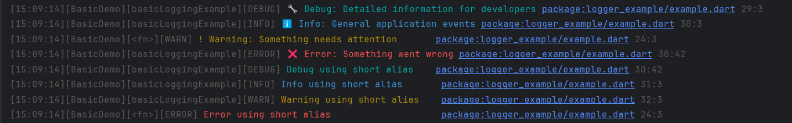
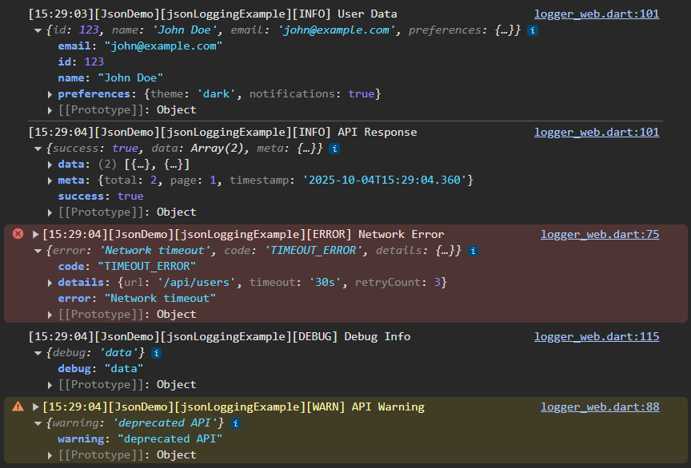
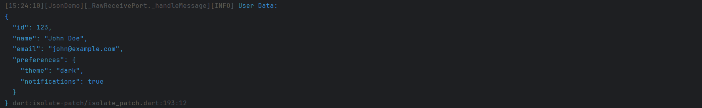
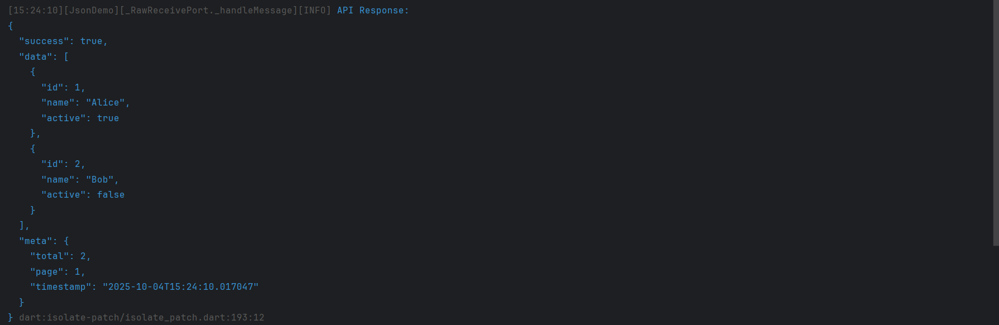
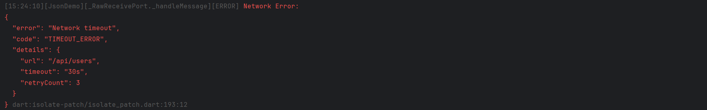
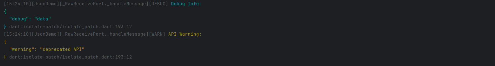
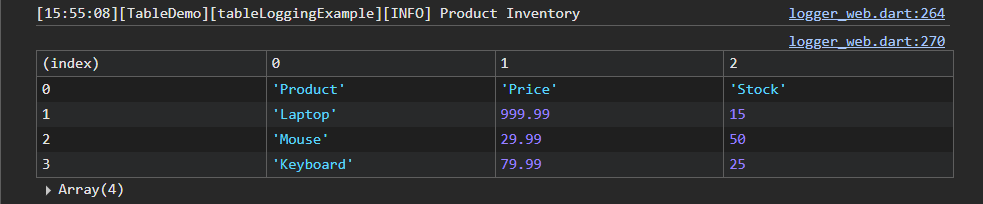
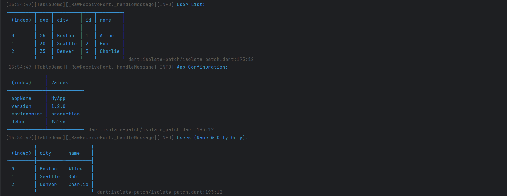
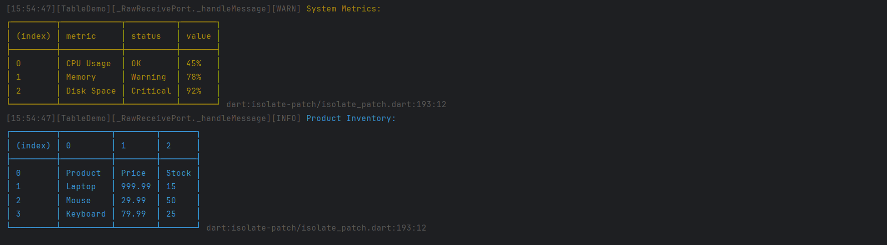

# Flutter Logger Pro 📝
#### Where logging meets the web! 🚀

A modern, feature-rich logging library for Dart and Flutter applications that makes debugging and monitoring effortless. **Specially optimized for web development** with interactive browser console integration, Flutter Logger Pro provides intelligent formatting, global configuration, and advanced JSON logging capabilities.

## 🌐 **Web-First Design**

Flutter Logger Pro is built with **web development as the primary focus**, offering:

- **🔍 Interactive Browser Console**: JSON objects become expandable, clickable trees in Chrome/Firefox DevTools
- **📊 Native console.table()**: Automatic table formatting using browser's built-in console.table()
- **🎯 Dual Output**: Logs appear in both browser console AND IDE debug console simultaneously
- **⚡ Zero Configuration**: Works perfectly out-of-the-box in Flutter Web projects
- **🛠️ Developer Tools Integration**: Seamless integration with browser developer tools

## 📋 Table of Contents

- [✨ Key Features & Platform Support](#-key-features--platform-support)
- [🚀 Quick Start](#-quick-start)
- [📖 Usage Guide](#-usage-guide)
- [📚 Real-World Examples & Use Cases](#-real-world-examples--use-cases)
- [⚙️ Configuration & Advanced Features](#️-configuration--advanced-features)
- [🔧 API Reference](#-api-reference)
- [🚀 Performance & Best Practices](#-performance--best-practices)
- [🤝 Contributing](#-contributing)
- [📄 License](#-license)

## ✨ Key Features & Platform Support

### 🌐 **Web-First Design**
- **Interactive Browser Console**: JSON objects become expandable, explorable trees in DevTools
- **Native console.table()**: Automatic table formatting using browser's console.table() API
- **Dual Platform Output**: Simultaneous logging to browser console AND IDE debug console
- **Smart Platform Detection**: Automatically adapts output format based on runtime environment

### 🎨 **Smart Features**
- **Colored Console Output**: ANSI color-coded log levels for instant visual recognition
- **Advanced JSON & Table Logging**: Handle complex objects, arrays, and structured data
- **Global Configuration**: Configure once, apply everywhere with runtime flexibility
- **Performance Optimized**: Lazy evaluation, early filtering, and minimal memory overhead

### 🌍 **Platform Support**

| Platform                            | Status              | Features                                          |
| ------------------------------------- | --------------------- | --------------------------------------------------- |
| **🌐 Flutter Web**                  | ⭐**Primary Focus** | Interactive console, console.table(), dual output |
| **Flutter Mobile** (iOS/Android)    | ✅ Full Support     | Colors, JSON, ASCII tables, all features          |
| **Flutter Desktop** (Win/Mac/Linux) | ✅ Full Support     | Native console output, ASCII tables               |
| **Dart Server**                     | ✅ Full Support     | Perfect for backend logging, JSON output          |
| **Dart CLI**                        | ✅ Full Support     | Command-line applications, colored output         |


## 🚀 Quick Start

### Installation

Add Flutter Logger Pro to your `pubspec.yaml`:

```yaml
dependencies:
  flutter_logger_pro: ^0.0.1
```

### 📦 **Compatibility**

Flutter Logger Pro supports a wide range of Dart SDK versions for maximum compatibility:

- **Dart SDK**: `>=3.0.0 <4.0.0` (supports Dart 3.0 and above)
- **Flutter**: `>=1.17.0` (compatible with most Flutter versions)

This broad compatibility ensures the package works with both legacy and cutting-edge Flutter projects.

**For Flutter Web projects** (recommended):

```yaml
dependencies:
  flutter:
    sdk: flutter
  flutter_logger_pro: ^0.0.1

dev_dependencies:
  flutter_test:
    sdk: flutter
```

> **💡 Compatibility Note**: Flutter Logger Pro supports Dart SDK `>=3.0.0 <4.0.0`, ensuring compatibility with a wide range of Flutter projects from legacy to cutting-edge versions.

### 🌐 **30-Second Web Setup**

```dart
import 'package:flutter_logger_pro/flutter_logger_pro.dart';

void main() {
  // Configure for optimal web experience (new static method)
  LoggerOptions.configure(
    enableLogging: true,
    enableColors: true,
    minLogLevel: LogLevel.debug,
    includeTimestamp: true,
    showFunctionName: true,
  );

  final logger = Logger(tag: 'WebApp');

  // Basic logging - appears in browser console with appropriate styling
  logger.debug('🔧 Debug info for developers');
  logger.info('🚀 App started successfully');
  logger.warn('⚠️ This is a warning');
  logger.error('❌ Something went wrong');

  // Short aliases for convenience
  logger.d('Debug using short alias');
  logger.i('Info using short alias');
  logger.w('Warning using short alias');
  logger.e('Error using short alias');

  // 🔥 Interactive JSON logging - click to expand in browser DevTools!
  final user = {
    'id': 123,
    'name': 'John Doe',
    'email': 'john@example.com',
    'preferences': {'theme': 'dark', 'notifications': true},
  };
  logger.jsonInfo(user, label: 'User Data');
  
  // 📊 Interactive table logging - uses native console.table() in browser!
  final users = [
    {'id': 1, 'name': 'Alice', 'age': 25, 'city': 'Boston'},
    {'id': 2, 'name': 'Bob', 'age': 30, 'city': 'Seattle'},
    {'id': 3, 'name': 'Charlie', 'age': 35, 'city': 'Denver'},
  ];
  logger.tableInfo(users, label: 'User List');
}
```

**🎯 Pro Tip**: Run this in Flutter Web and open your browser's Developer Tools (F12) to see the interactive logging in action!

## 📖 Usage Guide

### Basic Logging

```dart
void basicLoggingExample() {
  final logger = Logger(tag: 'BasicDemo');

  logger.debug('🔧 Debug: Detailed information for developers');
  logger.info('ℹ️ Info: General application events');
  logger.warn('⚠️ Warning: Something needs attention');
  logger.error('❌ Error: Something went wrong');

  // Short aliases for convenience
  logger.d('Debug using short alias');
  logger.i('Info using short alias');
  logger.w('Warning using short alias');
  logger.e('Error using short alias');
}
```

**🌐 Browser Console Output:**


**🖥️ IDE Console Output:**



### JSON Logging

```dart
void jsonLoggingExample() {
  final logger = Logger(tag: 'JsonDemo');

  // Simple object logging
  final user = {
    'id': 123,
    'name': 'John Doe',
    'email': 'john@example.com',
    'preferences': {'theme': 'dark', 'notifications': true},
  };
  logger.jsonInfo(user, label: 'User Data');

  // API response example
  final apiResponse = {
    'success': true,
    'data': [
      {'id': 1, 'name': 'Alice', 'active': true},
      {'id': 2, 'name': 'Bob', 'active': false},
    ],
    'meta': {
      'total': 2,
      'page': 1,
      'timestamp': DateTime.now().toIso8601String(),
    },
  };
  logger.jsonInfo(apiResponse, label: 'API Response');

  // Error context logging
  final errorInfo = {
    'error': 'Network timeout',
    'code': 'TIMEOUT_ERROR',
    'details': {'url': '/api/users', 'timeout': '30s', 'retryCount': 3},
  };
  logger.jsonError(errorInfo, label: 'Network Error');

  // Different log levels for JSON
  logger.jsonDebug({'debug': 'data'}, label: 'Debug Info');
  logger.jsonWarn({'warning': 'deprecated API'}, label: 'API Warning');
}
```

**🌐 Browser Console Output:**



**🖥️ IDE Console Output:**



### Table Logging

```dart
void tableLoggingExample() {
  final logger = Logger(tag: 'TableDemo');

  // Array of objects - most common use case
  final users = [
    {'id': 1, 'name': 'Alice', 'age': 25, 'city': 'Boston'},
    {'id': 2, 'name': 'Bob', 'age': 30, 'city': 'Seattle'},
    {'id': 3, 'name': 'Charlie', 'age': 35, 'city': 'Denver'},
  ];
  logger.tableInfo(users, label: 'User List');

  // Single object - keys become rows
  final config = {
    'appName': 'MyApp',
    'version': '1.2.0',
    'environment': 'production',
    'debug': false,
  };
  logger.tableInfo(config, label: 'App Configuration');

  // Column filtering - show only specific columns
  logger.tableInfo(
    users,
    columns: ['name', 'city'],
    label: 'Users (Name & City Only)',
  );

  // Different log levels for tables
  final metrics = [
    {'metric': 'CPU Usage', 'value': '45%', 'status': 'OK'},
    {'metric': 'Memory', 'value': '78%', 'status': 'Warning'},
    {'metric': 'Disk Space', 'value': '92%', 'status': 'Critical'},
  ];
  logger.tableWarn(metrics, label: 'System Metrics');

  // Array of arrays format
  final matrix = [
    ['Product', 'Price', 'Stock'],
    ['Laptop', 999.99, 15],
    ['Mouse', 29.99, 50],
    ['Keyboard', 79.99, 25],
  ];
  logger.tableInfo(matrix, label: 'Product Inventory');
}
```

**🌐 Browser Console Output:**



**🖥️ IDE Console Output:**





#### Supported Data Formats

**Array of Objects** - Each object becomes a row with keys as column headers:

```dart
final users = [
  {'id': 1, 'name': 'Alice', 'age': 25, 'city': 'Boston'},
  {'id': 2, 'name': 'Bob', 'age': 30, 'city': 'Seattle'},
  {'id': 3, 'name': 'Charlie', 'age': 35, 'city': 'Denver'},
];
logger.tableInfo(users, label: 'User List');
```

**Single Object** - Keys become row indices, values in a "Values" column:

```dart
final config = {
  'appName': 'MyApp',
  'version': '1.2.0',
  'environment': 'production',
  'debug': false,
};
logger.tableInfo(config, label: 'App Configuration');
```

**Array of Arrays** - Each inner array is a row with numeric column headers:

```dart
final matrix = [
  ['Product', 'Price', 'Stock'],
  ['Laptop', 999.99, 15],
  ['Mouse', 29.99, 50],
  ['Keyboard', 79.99, 25],
];
logger.tableInfo(matrix, label: 'Product Inventory');
```

**Column Filtering** - Display only specific columns:

```dart
logger.tableInfo(
  users,
  columns: ['name', 'city'],
  label: 'Users (Name & City Only)',
);
```

## 📚 Real-World Examples & Use Cases

### 1. **API Service Logging**

```dart
/// API service with comprehensive logging
void apiServiceExample() {
  final apiLogger = Logger(tag: 'ApiService');

  apiLogger.info('🌐 Making API request to /users');

  // Log request details
  final requestData = {
    'method': 'GET',
    'url': '/api/users',
    'headers': {'Authorization': 'Bearer token123'},
    'timestamp': DateTime.now().toIso8601String(),
  };
  apiLogger.jsonDebug(requestData, label: 'Request Details');

  // Simulate response
  final responseData = {
    'status': 200,
    'data': [
      {'id': 1, 'name': 'Alice'},
      {'id': 2, 'name': 'Bob'},
    ],
    'duration': '150ms',
  };
  apiLogger.jsonInfo(responseData, label: 'API Response');
}
```

### 2. **User Authentication Flow**

```dart
/// User authentication flow with logging
void authenticationExample() {
  final authLogger = Logger(tag: 'Auth');

  authLogger.info('🔐 User login attempt');

  // Log login attempt
  final loginData = {
    'email': 'user@example.com',
    'timestamp': DateTime.now().toIso8601String(),
    'ipAddress': '192.168.1.100',
    'userAgent': 'Flutter Web App',
  };
  authLogger.jsonDebug(loginData, label: 'Login Attempt');

  // Success case
  authLogger.info('✅ User authenticated successfully');

  // Log user session
  final sessionInfo = {
    'userId': 123,
    'sessionId': 'sess_abc123',
    'expiresAt': DateTime.now().add(Duration(hours: 24)).toIso8601String(),
    'permissions': ['read', 'write'],
  };
  authLogger.jsonInfo(sessionInfo, label: 'User Session Created');
}
```

### 3. **Error Handling with Context**

```dart
/// Error handling with comprehensive logging
void errorHandlingExample() {
  final errorLogger = Logger(tag: 'ErrorHandler');

  try {
    // Simulate an error
    throw Exception('Database connection failed');
  } catch (e, stackTrace) {
    // Log comprehensive error information
    final errorContext = {
      'error': e.toString(),
      'type': e.runtimeType.toString(),
      'timestamp': DateTime.now().toIso8601String(),
      'context': {'operation': 'fetchUserData', 'userId': 123, 'retryCount': 2},
      'stackTrace': stackTrace.toString().split('\n').take(5).toList(),
    };

    errorLogger.jsonError(errorContext, label: 'Database Error');
    errorLogger.error('❌ Operation failed: ${e.toString()}');
  }
}
```

### 4. **Performance Monitoring**

```dart
/// Performance monitoring example
void performanceExample() {
  final perfLogger = Logger(tag: 'Performance');

  // Track operation timing
  final stopwatch = Stopwatch()..start();

  // Simulate some work
  Future.delayed(Duration(milliseconds: 100));

  stopwatch.stop();

  // Log performance metrics
  final metrics = [
    {
      'operation': 'dataLoad',
      'duration': '${stopwatch.elapsedMilliseconds}ms',
      'status': 'success',
    },
    {'operation': 'renderUI', 'duration': '45ms', 'status': 'success'},
    {'operation': 'apiCall', 'duration': '230ms', 'status': 'timeout'},
  ];

  perfLogger.tableInfo(metrics, label: 'Operation Performance');

  // Memory usage
  final memoryInfo = {
    'heapUsed': '45MB',
    'heapTotal': '128MB',
    'external': '12MB',
    'timestamp': DateTime.now().toIso8601String(),
  };

  perfLogger.jsonInfo(memoryInfo, label: 'Memory Usage');
}
```

### 5. **Service Layer Integration**

Perfect for integrating with your existing service architecture:

```dart
class UserService {
  final _logger = Logger(tag: 'UserService');

  Future<User> getUser(String id) async {
    _logger.debug('Fetching user: $id');

    try {
      final user = await userRepository.findById(id);
      _logger.info('User retrieved: ${user.email}');
      return user;
    } catch (e) {
      _logger.error('Failed to get user $id: $e');
      rethrow;
    }
  }
}

class CounterBloc extends Bloc<CounterEvent, CounterState> {
  final _logger = Logger(tag: 'CounterBloc');

  @override
  void onTransition(Transition<CounterEvent, CounterState> transition) {
    _logger.jsonDebug({
      'event': transition.event.runtimeType.toString(),
      'currentState': transition.currentState.value,
      'nextState': transition.nextState.value,
    }, label: 'State Transition');

    super.onTransition(transition);
  }
}
```

## ⚙️ Configuration & Advanced Features

### Global & Per-Instance Configuration

```dart
void configurationExample() {
  // Global configuration - affects all new loggers (new static method)
  LoggerOptions.configure(
    enableLogging: true,
    enableColors: true,
    minLogLevel: LogLevel.info, // Only info and above
    includeTimestamp: true,
    dateTimeFormat: 'HH:mm:ss',
    showFunctionName: true,
    showLocation: false,
  );

  final globalLogger = Logger(tag: 'Global');
  globalLogger.debug('This debug message won\'t show (filtered by minLogLevel)');
  globalLogger.info('This info message will show');

  // Per-instance overrides
  final debugLogger = Logger(
    tag: 'Debug',
    enableColors: false, // Override global setting
    showLocation: true,  // Override global setting
  );
  debugLogger.info('Custom logger with different settings');
}

// Per-instance configuration - update settings for specific logger instances
void perInstanceConfigurationExample() {
  final logger = Logger(tag: 'MyService');
  
  // Configure multiple settings for this specific logger
  logger.configure(
    enableColors: false,
    showLocation: true,
    showFunctionName: false,
  );
  
  // Individual property setters for this logger
  logger.setEnableLogging(true);
  logger.setEnableColors(true);
  
  logger.info('This logger has custom local settings');
  
  // Reset this logger to use global defaults
  logger.reset();
  logger.info('Now using global settings again');
}

// Individual property setters - update specific settings without full reconfiguration
void individualPropertyExample() {
  // Set individual properties using static methods
  LoggerOptions.setEnableLogging(true);
  LoggerOptions.setEnableColors(false);
  LoggerOptions.setMinLogLevel(LogLevel.warn);
  LoggerOptions.setIncludeTimestamp(true);
  LoggerOptions.setDateTimeFormat('yyyy-MM-dd HH:mm:ss');
  LoggerOptions.setShowFunctionName(false);
  LoggerOptions.setShowLocation(true);
  LoggerOptions.setMessageTemplate('{level}: {message}');

  final logger = Logger(tag: 'Individual');
  logger.warn('Configuration updated using individual setters');
}

// Reset configuration to defaults
void resetExample() {
  // Reset all settings to defaults using static method
  LoggerOptions.reset();
  
  final logger = Logger(tag: 'Reset');
  logger.info('All settings reset to defaults');
}
```

### Custom Message Templates

Create your own log format for consistency across your application:

```dart
// Slack-style format (using static methods)
LoggerOptions.setIncludeTimestamp(true);
LoggerOptions.setMessageTemplate('[{timestamp}] {level} | {tag} | {message}');

// JSON-style format
LoggerOptions.setMessageTemplate('{"time":"{timestamp}","level":"{level}","tag":"{tag}","msg":"{message}"}');

// Minimal format
LoggerOptions.setMessageTemplate('{level}: {message}');

// Or configure multiple settings at once
LoggerOptions.configure(
  includeTimestamp: true,
  messageTemplate: '[{timestamp}] {level} | {tag} | {message}',
);

final logger = Logger(tag: 'CUSTOM');
logger.info('Custom formatted message');
```

### Production Configuration

```dart
import 'package:flutter/foundation.dart';

void configureProductionLogging() {
  if (kReleaseMode) {
    // Production: Essential logging only (using static methods)
    LoggerOptions.configure(
      minLogLevel: LogLevel.warn,  // Only warnings and errors
      enableColors: false,         // No colors in production
      showLocation: false,         // Cleaner production logs
      includeTimestamp: true,      // Keep timestamps for debugging
    );
  } else {
    // Development: Full interactive logging
    LoggerOptions.configure(
      minLogLevel: LogLevel.debug,
      enableColors: true,
      showLocation: true,
      includeTimestamp: true,
    );
  }
}
```

## 🔧 API Reference

### LoggerOptions Static Methods

| Method                                    | Description                                | Example                                    |
| ------------------------------------------- | -------------------------------------------- | -------------------------------------------- |
| `LoggerOptions.configure({...})`          | Configure multiple options at once        | `LoggerOptions.configure(enableColors: false)` |
| `LoggerOptions.reset()`                   | Reset all settings to defaults            | `LoggerOptions.reset()`                    |
| `LoggerOptions.setEnableLogging(bool)`    | Enable/disable all logging                | `LoggerOptions.setEnableLogging(false)`   |
| `LoggerOptions.setEnableColors(bool)`     | Enable/disable ANSI colors                | `LoggerOptions.setEnableColors(true)`     |
| `LoggerOptions.setMinLogLevel(LogLevel)`  | Set minimum log level                      | `LoggerOptions.setMinLogLevel(LogLevel.warn)` |
| `LoggerOptions.setShowFunctionName(bool)` | Show/hide function names                   | `LoggerOptions.setShowFunctionName(false)` |
| `LoggerOptions.setShowLocation(bool)`     | Show/hide file location info               | `LoggerOptions.setShowLocation(true)`     |
| `LoggerOptions.setIncludeTimestamp(bool)` | Include/exclude timestamps                 | `LoggerOptions.setIncludeTimestamp(true)` |
| `LoggerOptions.setDateTimeFormat(String)` | Set custom timestamp format               | `LoggerOptions.setDateTimeFormat('HH:mm:ss')` |
| `LoggerOptions.setMessageTemplate(String)` | Set custom message template               | `LoggerOptions.setMessageTemplate('{level}: {message}')` |

### LoggerOptions Properties

| Property           | Type        | Default      | Description                   | Example                       |
| -------------------- | ------------- | -------------- | ------------------------------- | ------------------------------- |
| `enableLogging`    | `bool?`     | `true`       | Master switch for all logging | `false` to disable all logs   |
| `enableColors`     | `bool?`     | `true`       | ANSI color codes in output    | `false` for plain text        |
| `minLogLevel`      | `LogLevel?` | `debug`      | Minimum level to display      | `LogLevel.warn` for warnings+ |
| `showFunctionName` | `bool?`     | `true`       | Display function names        | `[myFunction][TAG][INFO]`     |
| `showLocation`     | `bool?`     | `true`       | Display file:line info        | `main.dart:42`                |
| `includeTimestamp` | `bool?`     | `false`      | Add timestamps                | `[14:30:25][TAG][INFO]`       |
| `dateTimeFormat`   | `String?`   | `'HH:mm:ss'` | Timestamp format              | `'yyyy-MM-dd HH:mm:ss'`       |
| `messageTemplate`  | `String?`   | `null`       | Custom message format         | `'{level}: {message}'`        |

### Logger Constructor Parameters

| Parameter          | Type      | Description                    | Use Case                        |
| -------------------- | ----------- | -------------------------------- | --------------------------------- |
| `tag`              | `String?` | Identifier for this logger     | `'API'`, `'Database'`, `'Auth'` |
| `enableLogging`    | `bool?`   | Override global logging        | Critical loggers always on      |
| `enableColors`     | `bool?`   | Override global colors         | Specific logger styling         |
| `showFunctionName` | `bool?`   | Override function name display | Debug-specific loggers          |
| `showLocation`     | `bool?`   | Override location display      | Production vs development       |

### Logger Instance Methods

| Method                                    | Description                                | Example                                    |
| ------------------------------------------- | -------------------------------------------- | -------------------------------------------- |
| `logger.configure({...})`                 | Configure multiple local settings at once | `logger.configure(enableColors: false)`   |
| `logger.reset()`                          | Reset to global defaults                  | `logger.reset()`                          |
| `logger.setEnableLogging(bool)`           | Enable/disable logging for this logger   | `logger.setEnableLogging(false)`          |
| `logger.setEnableColors(bool)`            | Enable/disable colors for this logger    | `logger.setEnableColors(true)`            |
| `logger.setShowFunctionName(bool)`        | Show/hide function names for this logger | `logger.setShowFunctionName(false)`       |
| `logger.setShowLocation(bool)`            | Show/hide location info for this logger  | `logger.setShowLocation(true)`            |

### JSON Logging API

| Method                         | Level        | Description              | Best For                     |
| -------------------------------- | -------------- | -------------------------- | ------------------------------ |
| `json(object, {level, label})` | Configurable | Main JSON logging method | Custom log levels            |
| `jsonDebug(object, {label})`   | Debug        | Development debugging    | Complex object inspection    |
| `jsonInfo(object, {label})`    | Info         | General information      | API responses, state changes |
| `jsonWarn(object, {label})`    | Warning      | Potential issues         | Deprecated usage, fallbacks  |
| `jsonError(object, {label})`   | Error        | Error conditions         | Exception details, failures  |

### Table Logging API

Flutter Logger Pro includes powerful table formatting capabilities similar to `console.table` in JavaScript, perfect for displaying structured data in a readable format.

| Method                                 | Level        | Description               | Best For                      |
| ---------------------------------------- | -------------- | --------------------------- | ------------------------------- |
| `table(data, {columns, level, label})` | Configurable | Main table logging method | Custom log levels             |
| `tableDebug(data, {columns, label})`   | Debug        | Development debugging     | Data structure inspection     |
| `tableInfo(data, {columns, label})`    | Info         | General information       | API responses, configuration  |
| `tableWarn(data, {columns, label})`    | Warning      | Potential issues          | Performance metrics, warnings |
| `tableError(data, {columns, label})`   | Error        | Error conditions          | Error logs, failed operations |

### Message Template Variables

| Variable         | Description        | Example Output   |
| ------------------ | -------------------- | ------------------ |
| `{timestamp}`    | Current timestamp  | `14:30:25`       |
| `{level}`        | Log level name     | `INFO`, `ERROR`  |
| `{message}`      | The log message    | `User logged in` |
| `{className}`    | Calling class name | `UserService`    |
| `{tag}`          | Logger tag         | `API`            |
| `{functionName}` | Calling function   | `loginUser`      |
| `{location}`     | File location      | `main.dart:42`   |

## 🚀 Performance & Best Practices

### Performance Optimizations

Flutter Logger Pro is built for production use with several performance optimizations:

```dart
// ✅ Good: Early filtering prevents expensive operations
LoggerOptions.setMinLogLevel(LogLevel.warn);
logger.debug('This expensive ${computeExpensiveValue()}'); // Never computed

// ✅ Good: Lazy evaluation
logger.info('User count: ${users.length}'); // Only computed if logging enabled

// ✅ Good: Efficient singleton pattern
final logger1 = Logger(tag: 'Service1'); // Fast
final logger2 = Logger(tag: 'Service2'); // Fast
```

### Best Practices

#### 1. **Use Appropriate Log Levels**

```dart
logger.debug('Variable value: $variable');        // Development only
logger.info('User logged in: ${user.email}');     // Important events
logger.warn('API rate limit approaching');        // Potential issues
logger.error('Database connection failed: $e');   // Critical problems
```

#### 2. **Leverage Global Configuration**

```dart
import 'package:flutter/foundation.dart';

// Configure once at app startup
void configureLogging() {
  if (kReleaseMode) {
    LoggerOptions.configure(
      minLogLevel: LogLevel.warn,  // Production: warnings and errors only
      enableColors: false,         // No colors in production logs
      showLocation: false,         // Cleaner production output
    );
  } else {
    LoggerOptions.configure(
      minLogLevel: LogLevel.debug, // Development: all logs
      showLocation: true,          // Helpful for debugging
    );
  }
}
```

#### 3. **Use Meaningful Tags**

```dart
// ✅ Good: Descriptive tags
final authLogger = Logger(tag: 'Auth');
final dbLogger = Logger(tag: 'Database');
final apiLogger = Logger(tag: 'API');

// ❌ Avoid: Generic or unclear tags
final logger = Logger(tag: 'Log');
final myLogger = Logger(tag: 'MyClass');
```

### 🌐 **Why Web-First?**

Flutter Logger Pro is designed with **web development as the primary platform** because:

- **🔥 Modern Development**: Most Flutter development happens in web browsers during development
- **🛠️ Superior DevTools**: Browser developer tools provide the best debugging experience
- **📊 Interactive Data**: Native browser console allows real-time object exploration
- **⚡ Performance**: Direct JavaScript object logging without serialization overhead
- **🎯 Developer Experience**: Seamless integration with existing web development workflows

## 🔄 Upgrading to Static Methods

If you're upgrading from a previous version, you can now use the cleaner static methods:

#### Before (still works for backward compatibility):
```dart
LoggerOptions.instance.configure(
  enableLogging: true,
  enableColors: false,
);
LoggerOptions.instance.reset();
```

#### After (recommended new approach):
```dart
// Bulk configuration
LoggerOptions.configure(
  enableLogging: true,
  enableColors: false,
);

// Individual property updates
LoggerOptions.setEnableColors(true);
LoggerOptions.setMinLogLevel(LogLevel.warn);

// Reset to defaults
LoggerOptions.reset();

// Per-instance configuration (new feature)
final logger = Logger(tag: 'MyService', enableColors: false);
logger.configure(showLocation: true, showFunctionName: false);
logger.setEnableLogging(false);
logger.reset(); // Back to global defaults
```

#### Benefits of Static Methods:
- **Cleaner API**: No need to access `.instance`
- **Better IDE Support**: Improved autocomplete and discoverability
- **Granular Updates**: Update individual properties without full reconfiguration
- **Backward Compatible**: All existing code continues to work

#### Benefits of Logger Instance Methods:
- **Per-Logger Customization**: Each logger can have its own settings
- **Runtime Configuration**: Change logger behavior dynamically during execution
- **Flexible Hierarchy**: Global defaults → constructor parameters → runtime methods
- **Easy Reset**: Quickly revert to global defaults with `logger.reset()`

#### Configuration Hierarchy:
```dart
// 1. Global defaults (lowest priority)
LoggerOptions.configure(enableColors: true, showLocation: false);

// 2. Constructor parameters (medium priority)
final logger = Logger(tag: 'API', enableColors: false);

// 3. Runtime instance methods (highest priority)
logger.setShowLocation(true);
logger.configure(showFunctionName: false);

// Result: enableColors=false, showLocation=true, showFunctionName=false
```

## 🤝 Contributing

We welcome contributions! Here's how you can help:

- 🐛 **Report bugs** by opening an issue
- 💡 **Suggest features** for new functionality
- 📖 **Improve documentation** with better examples
- 🔧 **Submit pull requests** for bug fixes or features
- 🌐 **Web-specific improvements** are especially welcome!

### Development Setup

```bash
git clone https://github.com/VatsalJaganwala/flutter_logger_pro.git
cd flutter_logger_pro
dart pub get
dart test

# For web-specific testing
flutter run -d chrome example/
```

### Testing Web Features

```bash
# Run the web example to test browser console integration
cd example
flutter run -d chrome

# Open browser DevTools (F12) to see:
# - Interactive JSON objects
# - Native console.table() rendering
# - Dual-output logging
```

## 📄 License

This project is licensed under the MIT License - see the [LICENSE](LICENSE) file for details.

---

## 🚀 **Quick Web Deployment**

Ready to deploy your Flutter Web app with Flutter Logger Pro? Here's how:

### Build and Deploy

```bash
# Build for web with optimizations
flutter build web --release

# Deploy to your favorite hosting platform
# - Firebase Hosting
# - Netlify  
# - Vercel
# - GitHub Pages
# - Your own server
```

## 🎯 **Why Choose Flutter Logger Pro?**

### ✅ **Perfect for Web Development**

- **Interactive Debugging**: Click and explore objects in browser DevTools
- **Native Integration**: Uses browser's console.table() and object inspection
- **Dual Output**: See logs in both browser and IDE simultaneously
- **Zero Config**: Works perfectly out-of-the-box

### ✅ **Production Ready**

- **Performance Optimized**: Lazy evaluation and minimal overhead
- **Configurable**: Fine-tune logging for different environments
- **Cross-Platform**: Same API works on web, mobile, desktop, and server
- **Reliable**: Comprehensive error handling and fallbacks
- **Wide Compatibility**: Supports Dart SDK `>3.3.0 <4.0.0` for maximum project compatibility

### ✅ **Developer Experience**

- **Intuitive API**: Simple, consistent methods across all platforms
- **Rich Documentation**: Comprehensive examples and use cases
- **Active Development**: Regular updates and improvements
- **Community Driven**: Open source with welcoming contribution guidelines

---

**🌐 Made with ❤️ for the modern web-first Flutter development community**

*Flutter Logger Pro - Where logging meets the web! 🚀*